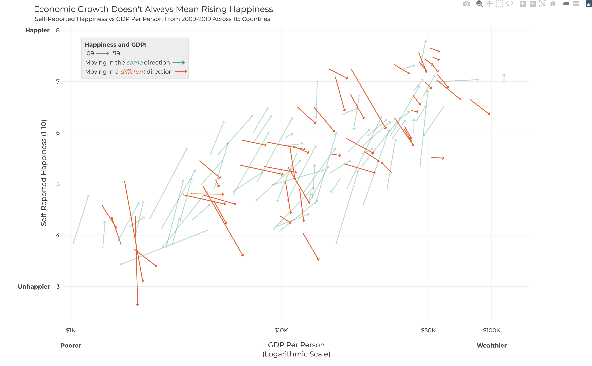
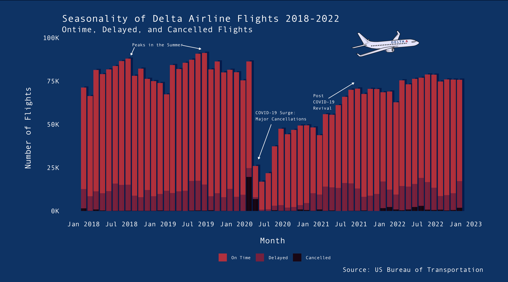
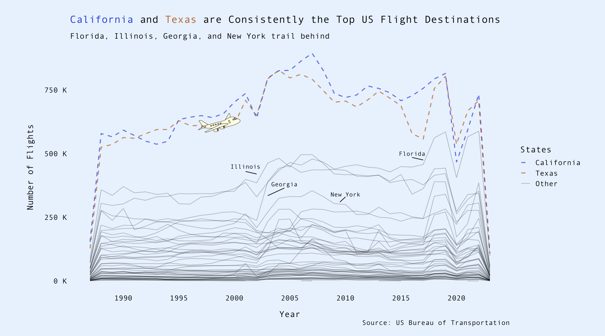

# Advanced-Data-Visualization-QSS-19

In Spring 2023, I took QSS 19: Advanced Data Visualization with Professor Robert Cooper. Below are the figures I produced for various assignments throughout the course. 

We learned in class that an excellent data visualization will satisfy the following tenants, and I tried my very best to encompass each one in my assignments
- Accurate and Fitting
- Revelatory
- Reductive
- Attention Grabbing

### Assignment 1: 
#### Visualization in the Wild. Find a bad visualization in the wild and try to improve it

(This visualization is interactive and can be run in `Project1-WIID` folder)

### Assignment 2:
#### Create two data visualizations with the same dataset showing different stories

### Assignment 3:
#### Do anything you want

