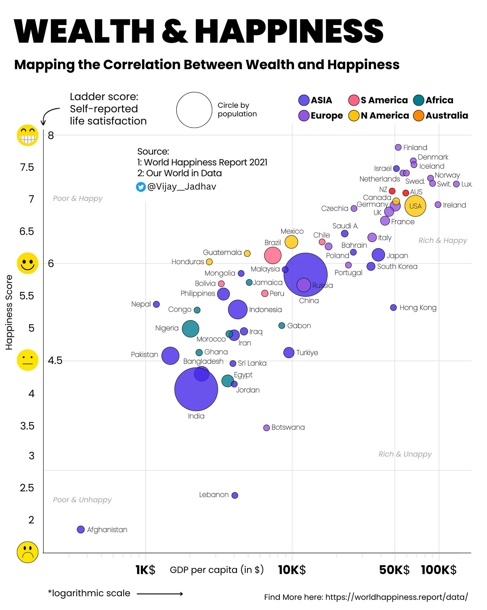
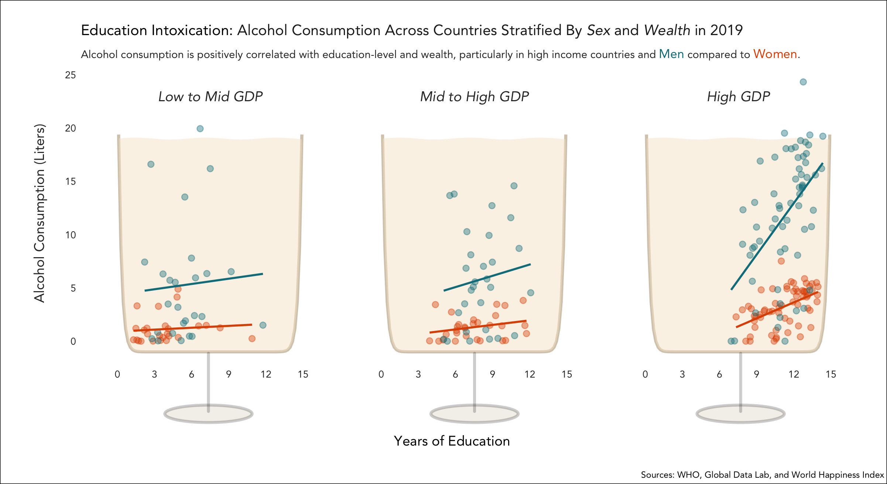
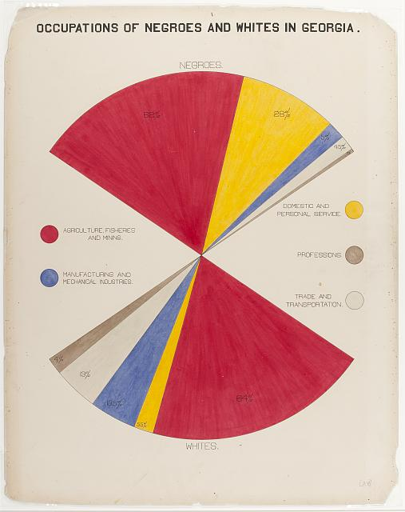
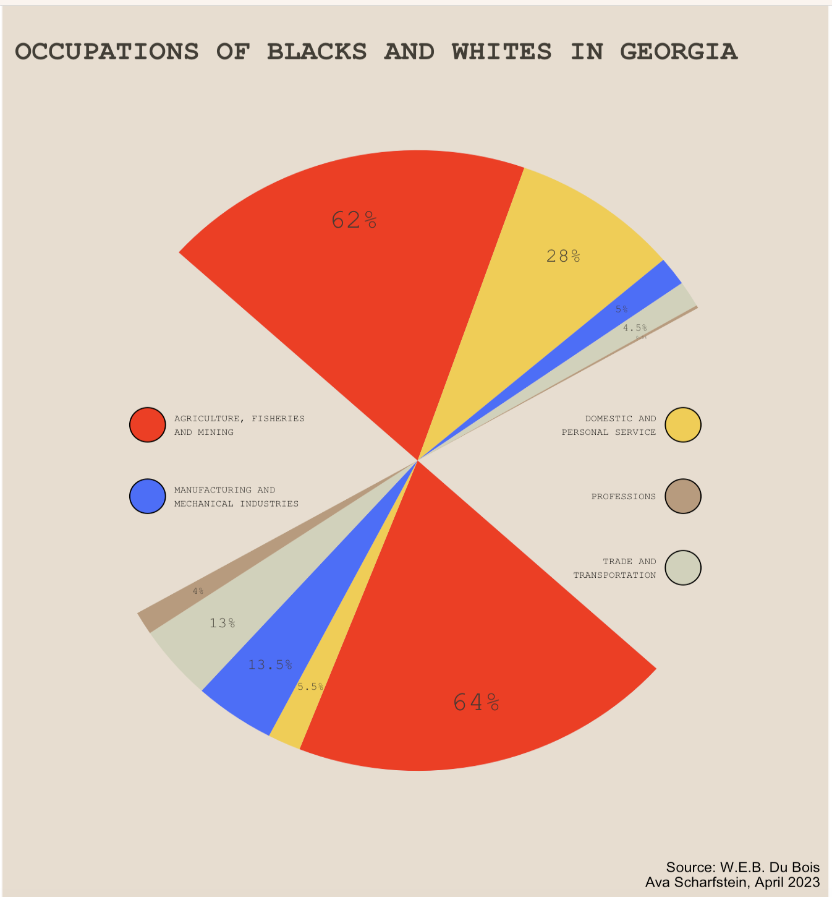

# Advanced-Data-Visualization-QSS-19

In Spring 2023, I took QSS 19: Advanced Data Visualization with Professor Robert Cooper. Below are the figures I produced for various assignments throughout the course. 

We learned in class that excellent data visualizations satisfy the following tenants, which guided me throughout these projects:
- Accurate and Fitting
- Revelatory
- Reductive
- Attention Grabbing

### Assignment 1: 
#### Visualization in the Wild. Find a bad visualization in the wild and try to improve it

The Original:

My Improved figure (This visualization is interactive and can be run in `Project1-WIID` folder):

### Assignment 2:
#### Create two data visualizations with the same dataset showing different stories

### Assignment 3:
#### Do anything you want
You can find my project referenced [here](https://qss.dartmouth.edu/news/2023/09/look-back-first-iteration-qss-19-advanced-data-visualization) on the Quantitative Social Science department website!

### Other visualizations

#### A Recreation of W.E.B. Dubois' “The Negro Problem”:

